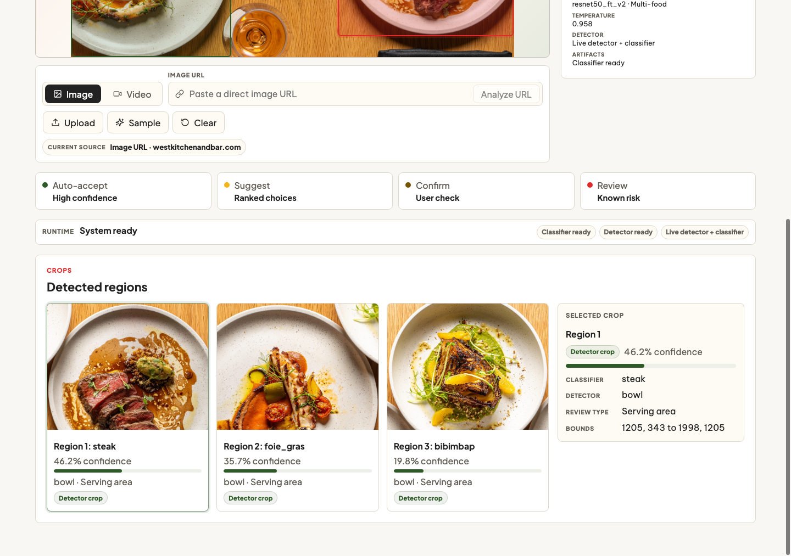
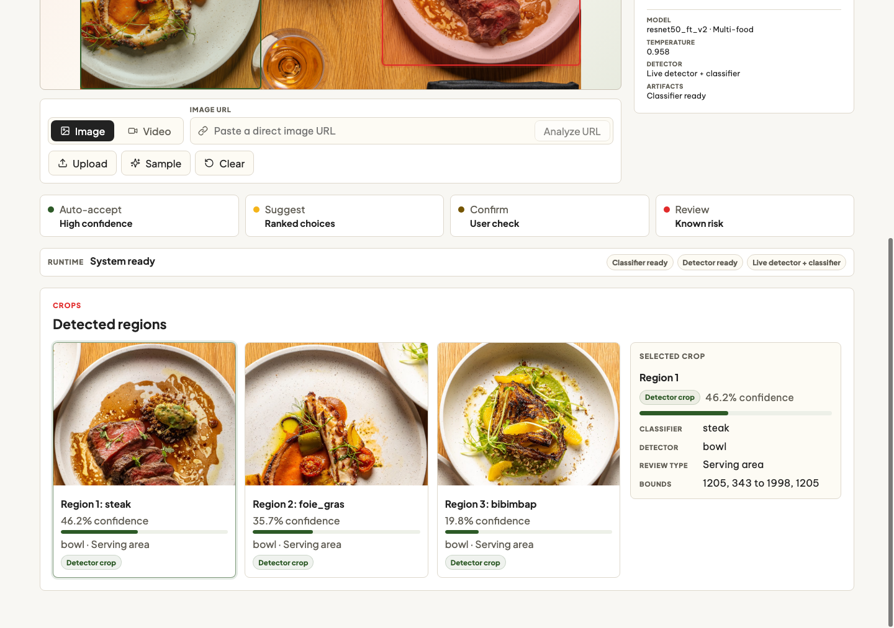
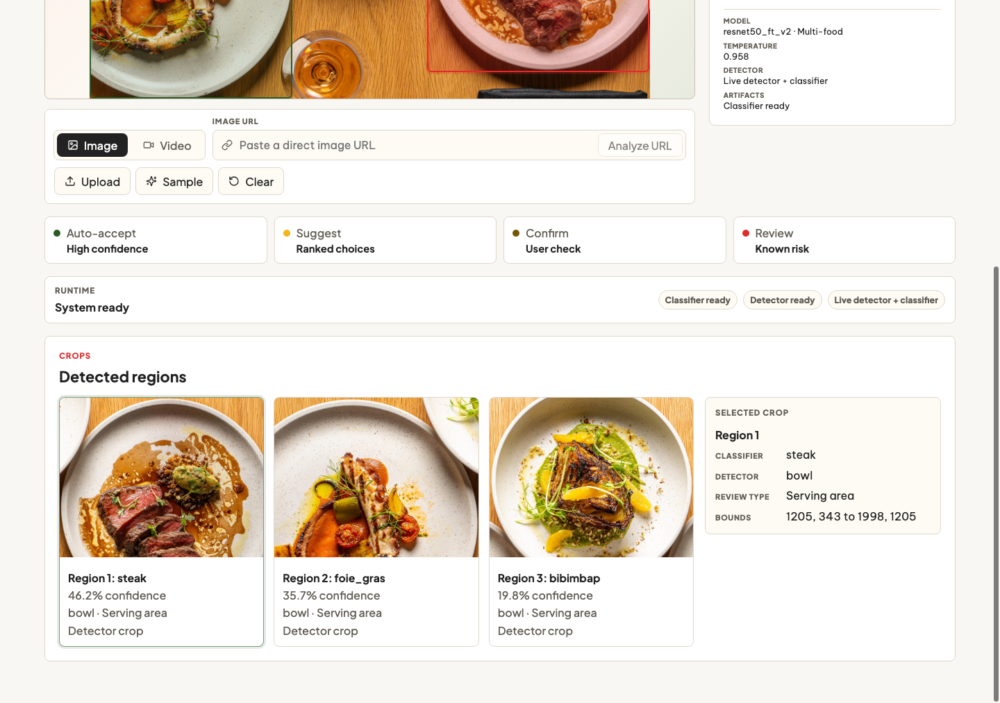
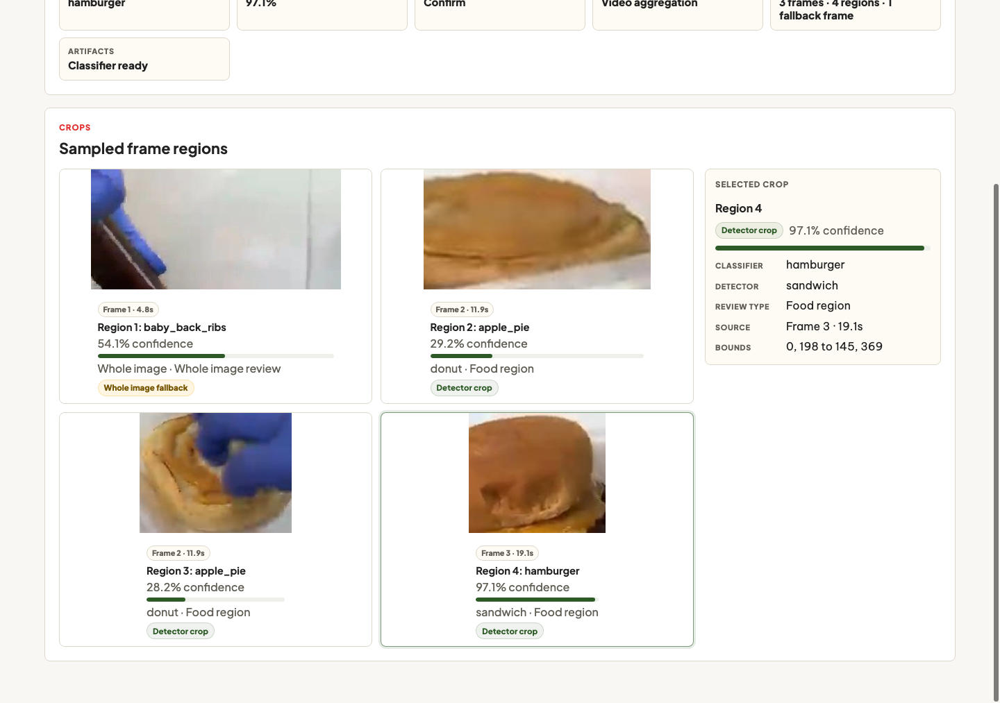

# FoodLens: Calibrated Food Recognition


FoodLens is a computer vision project for calibrated food recognition. It
trains and evaluates Food-101 classifiers, converts model confidence into
product decisions, and extends single-image classification into a multi-food
analysis prototype with a FastAPI backend and React/Vite frontend.

The current champion is a refined ResNet50 FT-V2 model with strong top-5
performance, low calibration error, and a decision layer that routes predictions
into auto-accept, suggest, confirm, or review workflows.

## Highlights

- Classifies Food-101 images across 101 food categories.
- Evaluates top-1 accuracy, top-5 accuracy, calibration, model size, parameter
  count, and inference latency.
- Uses temperature scaling and confidence thresholds to support product-ready
  decisions instead of exposing raw model confidence.
- Includes a React Analyzer Workbench for image, video, URL, and YouTube-style
  food analysis workflows.
- Supports live inference when model artifacts are available and deterministic
  demo fallback responses when artifacts are missing.
- Explores multi-food detection by generating candidate regions, classifying
  crops, and returning crop-level FoodLens predictions.

## Demo Walkthrough

The FoodLens Analyzer Workbench turns an image, video, or URL into detected food
regions, crop-level predictions, calibrated confidence, and a product decision
band.

### 1. Submit an image source

FoodLens accepts local uploads and direct image URLs. The workbench keeps the
submitted source visible so the analysis can be traced back to the original
input.



### 2. Detect candidate food regions

The backend proposes food regions, overlays them on the source image, and
returns crop cards for each detected area. Each card includes the classifier
label, confidence, detector label, and review type.



### 3. Review the selected crop

Selecting a crop exposes the detailed classifier and detector metadata used by
the decision layer. The interface separates model confidence from product
action, so ambiguous dishes can be suggested or confirmed instead of accepted
blindly.



### 4. Analyze sampled video frames

For video inputs, the frontend samples key frames and sends each frame through
the same multi-food image pipeline. Results are grouped as frame-level regions
so the user can review the strongest food predictions across time.



More interface captures are indexed in
[docs/ui-snapshots/README.md](docs/ui-snapshots/README.md).

## Results

| Item | Value |
| --- | ---: |
| Dataset | Food-101 |
| Images | 101,000 |
| Classes | 101 |
| Images per class | 1,000 |
| Split strategy | Stratified train / validation / test |

| Metric | ResNet50 FT-V2 champion |
| --- | ---: |
| Validation top-1 accuracy | 77.90% |
| Validation top-5 accuracy | 92.36% |
| Test top-1 accuracy | 78.28% |
| Test top-5 accuracy | 92.65% |
| Test calibration ECE | 0.0265 |
| Auto-accept coverage | 58.02% |
| Auto-accept top-1 accuracy | 96.47% |
| Suggestion-band top-5 containment | 100.00% |
| Parameters | 24.7M |
| Model size | 94.48 MB |
| T4 latency | 5.35 ms/image |

### Model Comparison

| Model | Stage | Test top-1 | Test top-5 | Parameters | Model size | T4 latency |
| --- | --- | ---: | ---: | ---: | ---: | ---: |
| ResNet50 FT-V2 | current champion | 78.28% | 92.65% | 24.7M | 94.48 MB | 5.35 ms/image |
| ConvNeXt-Tiny | frozen-head challenger | 70.92% | 90.24% | 28.4M | 108.23 MB | 7.17 ms/image |
| EfficientNet-B0 | frozen-head challenger | 52.13% | 77.02% | 4.8M | 18.55 MB | 7.44 ms/image |

The largest improvement came from refining the ResNet50 training recipe rather
than switching backbones. ResNet50 FT-V2 improved held-out test top-1 accuracy
by 4.63 percentage points over the first fine-tuned ResNet50 baseline.

## Repository Structure

```text
.
|-- app/
|   |-- backend/           # FastAPI service and inference contract
|   |-- frontend/          # React/Vite Analyzer Workbench
|   |-- frontend-static/   # Archived static prototype
|   `-- artifacts/         # Local model artifacts; kept out of git
|-- docs/                  # Project documentation, results, and roadmap
|-- notebooks/             # Reproducible experiment notebooks
`-- tests/backend/         # Backend API and ingestion tests
```

## Quick Start

### Backend

```bash
python3 -m venv .venv
source .venv/bin/activate
pip install -r app/backend/requirements.txt
pip install -r app/backend/requirements-dev.txt
uvicorn app.backend.api:app --reload --port 8000
```

Optional detector runtime for live multi-food proposals:

```bash
pip install -r app/backend/requirements-detector.txt
```

Backend checks:

```bash
python3 -m pytest tests/backend -v
```

### Frontend

```bash
cd app/frontend
npm install
npm run dev
```

Frontend checks:

```bash
cd app/frontend
npm test
npm run typecheck
npm run build
```

The frontend calls the local API when the backend is running. If live artifacts
are not available, the app still works through deterministic fallback
predictions so the interface and response contracts remain testable.

## API Surface

```text
GET  /health
GET  /runtime/status
POST /predict/image
POST /predict/multi-food/image
POST /predict/multi-food/image-url
POST /predict/multi-food/youtube-url
POST /predict/video
```

`/runtime/status` reports classifier artifact readiness, detector dependency
availability, detector weight resolution, and the effective multi-food mode.
Fallback responses include `fallback_reason` and detector status fields so
clients can distinguish demo data, detector-only crops, and live inference.

## Model Artifacts

Large trained artifacts are intentionally excluded from git. Real inference
expects the following files under `app/artifacts/` or a path provided through
`FOODLENS_ARTIFACT_DIR`:

- `resnet50_ft_v2_best.pth`
- `class_names.json`
- `calibration.json`
- `decision_policy.json`
- `hard_classes.json`
- `confusion_pairs.json`

The ResNet50 FT-V2 checkpoint is managed as a separate Kaggle model artifact.
Notebook 6 exports the JSON files and demo CSVs, and also packages them into
`foodlens_app_artifacts.zip` for convenient transfer into the app runtime.

For multi-food detection, the backend uses the optional `ultralytics` runtime.
Set `FOODLENS_DETECTOR_WEIGHTS` to override the default `yolo11n.pt` detector
weights path.

## Experiment Notebooks

| Notebook | Purpose |
| --- | --- |
| `01_food101_baseline_transfer_finetuning.ipynb` | Baseline data ingestion, transfer learning, ResNet50 fine-tuning, test evaluation, confusion analysis, and efficiency reporting. |
| `02_resnet50_training_refinements.ipynb` | Improved ResNet50 training with longer fine-tuning, AdamW, LR scheduling, stronger augmentation, and label smoothing. |
| `03_modern_backbone_comparison.ipynb` | EfficientNet-B0 and ConvNeXt-Tiny comparison against ResNet50 FT-V2. |
| `04_resnet50_error_calibration_inference.ipynb` | Champion error analysis, calibration metrics, hard classes, high-confidence errors, and deterministic inference. |
| `05_confidence_decision_layer.ipynb` | Confidence policy for auto-accept, suggestion, confirmation, and review decisions. |
| `06_food_recognition_demo_inference.ipynb` | Final single-image demo workflow and lightweight app artifact exports. |
| `07_multi_food_detection_exploration.ipynb` | Pretrained detector exploration for food images and videos. |
| `08_detection_to_foodlens_pipeline.ipynb` | Detector-to-classifier pipeline for crop-level FoodLens predictions. |

## Key Findings

- Top-5 accuracy above 92% makes the model especially useful as a ranked
  suggestion system.
- Temperature scaling reduced test ECE from 0.0432 to 0.0265 without changing
  the prediction ranking.
- The most difficult classes are visually similar foods, including steak-like
  dishes, tartare or ceviche dishes, pastry-style desserts, and chocolate
  desserts.
- Confidence thresholds make the model more practical by separating easy
  predictions from cases that need confirmation or review.
- Generic object detectors can support a prototype, but a food-specific
  detector or segmentation model is the next major quality improvement.

## Product Direction

FoodLens is designed as an image-first food recognition assistant for workflows
such as user-assisted tagging, menu enrichment, search, and food diary entry.
The current Analyzer Workbench accepts image and video inputs, presents ranked
predictions, and exposes the decision band that should drive the user
experience.

Detailed documentation is available in:

- [docs/README.md](docs/README.md)
- [docs/03_modeling_approach.md](docs/03_modeling_approach.md)
- [docs/04_model_results.md](docs/04_model_results.md)
- [docs/05_next_steps.md](docs/05_next_steps.md)
- [docs/06_foodlens_app_concept.md](docs/06_foodlens_app_concept.md)
- [docs/07_multi_food_detection_plan.md](docs/07_multi_food_detection_plan.md)

## Roadmap

- Improve detector quality with food-specific detection or segmentation.
- Expand live video inference beyond sampled-frame review.
- Add richer metadata for known confusion pairs and hard classes.
- Validate the decision layer on real product workflows and user feedback.
- Package model artifacts and runtime configuration for repeatable deployment.

Banner image source:
[`logmeal.com`](https://logmeal.com/static/image/logmeal-food-detection-recognition-api-services.jpg)
